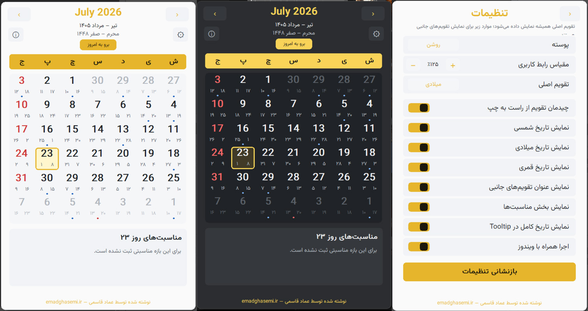

# گاه‌یار

<p align="center">
  
</p>

گاه‌یار یک تقویم فارسی سبک و بومی برای Windows است که با Rust و Win32 نوشته شده و از System Tray در دسترس قرار می‌گیرد.

## نمای برنامه

<p align="center">
  
</p>

## دریافت برنامه

آخرین نسخه `GahYar.exe` را از صفحه [Releases](https://github.com/emadgh/GahYar/releases/latest) دریافت کنید. برنامه قابل‌حمل است و نیازی به نصب ندارد.

## امکانات

- رابط کاملاً راست‌چین با تقویم شمسی، میلادی و قمری
- چیدمان راست‌به‌چپ تقویم به‌صورت پیش‌فرض، با امکان تغییر از تنظیمات
- انتخاب تقویم اصلی و نمایش تقویم‌های جانبی
- مناسبت‌ها و تعطیلات رسمی آفلاین سال ۱۴۰۵
- پوسته روشن و تیره و مقیاس رابط از ۸۰ تا ۱۲۵ درصد
- کپی تاریخ هر روز با دابل‌کلیک
- نمایش اختیاری روز هفته و تاریخ کامل امروز در Tooltip آیکن
- اجرای خودکار همراه Windows
- نصب اختیاری در Program Files و حذف برنامه از داخل تنظیمات، با پنجره‌های تأیید هماهنگ با تم گاه‌یار
- اگر نسخهٔ قابل‌حمل از مسیر دیگری اجرا شود، گزینهٔ نصب به «بروزرسانی نسخهٔ نصب‌شده» تبدیل می‌شود و فایل فعلی را جایگزین می‌کند
- اجرای تک‌نسخه‌ای؛ اجرای دوباره، تقویم موجود را نمایش می‌دهد
- بررسی نسخه جدید از GitHub هنگام اجرا و سپس هر ۶ ساعت
- بروزرسانی کاملاً خودکار و بی‌صدا با امکان غیرفعال‌سازی
- بررسی دستی بروزرسانی از پنجره درباره و منوی راست‌کلیک System Tray
- نمایش مناسبت روز هنگام نگه‌داشتن نشانگر موس روی آن
- امکان نمایش شماره روز شمسی روی آیکن System Tray
- نمایش تاریخ کامل تقویم اصلی در بالای برنامه
- حالت «تقویم کوچک (روز بدون تقویم)» با تاریخ دقیق تقویم‌های جانبی، حرکت روزبه‌روز و نمایش مناسبت‌های همان روز
- پنجرهٔ مستقل تنظیمات در کنار تقویم برای مشاهدهٔ هم‌زمان نتیجهٔ تغییرات
- فونت Vazirmatn تعبیه‌شده در فایل اجرایی؛ بدون نیاز به نصب فونت
- نمایش نام سازنده و نسخه برنامه با لینک وب‌سایت و مخزن GitHub

## استفاده

با کلیک روی آیکن گاه‌یار کنار ساعت، تقویم نمایش یا مخفی می‌شود. برای کپی یک تاریخ روی روز موردنظر دابل‌کلیک کنید. تنظیمات پوسته، اندازه، تقویم‌های جانبی، مناسبت‌ها، Tooltip و اجرای خودکار از داخل برنامه قابل تغییر است.

نسخهٔ قابل‌حمل را می‌توانید مستقیماً اجرا کنید یا از داخل تنظیمات در Program Files نصب کنید. نصب و حذف هر دو پس از تأیید کاربر و با درخواست دسترسی مدیر انجام می‌شوند.

فایل مناسبت‌ها داخل فایل اجرایی قرار دارد. برای جایگزینی داده‌ها می‌توانید فایل `iran-calendar-events-1405.json` را کنار `GahYar.exe` قرار دهید.

## ساخت از سورس

### پیش‌نیازها

- Windows 10 یا Windows 11
- Rust stable با target مربوط به MSVC
- Windows SDK شامل `rc.exe`

فونت Vazirmatn نسخه `v33.003` همراه با مجوز OFL در پوشه `fonts` قرار دارد و هنگام build داخل فایل اجرایی تعبیه می‌شود.

```powershell
rustup target add x86_64-pc-windows-msvc
cargo test --target x86_64-pc-windows-msvc
cargo build --release --target x86_64-pc-windows-msvc
```

فایل خروجی در مسیر زیر ساخته می‌شود:

```text
target\x86_64-pc-windows-msvc\release\GahYar.exe
```

## سازنده

نوشته شده توسط [عماد قاسمی](https://emadghasemi.ir)

## مجوز

این پروژه با مجوز [MIT](LICENSE) منتشر شده است.
